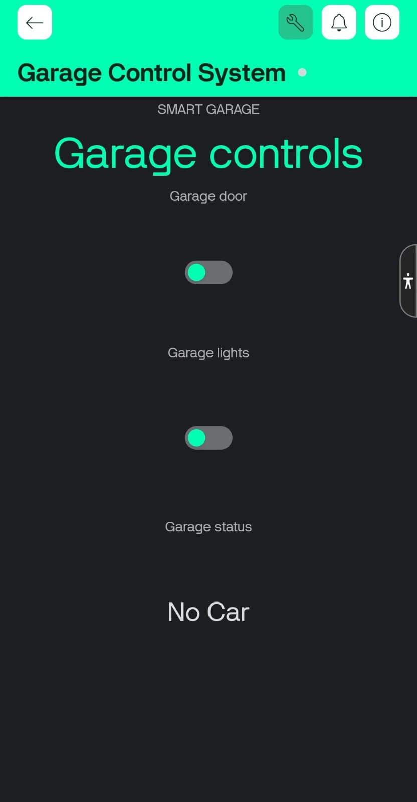
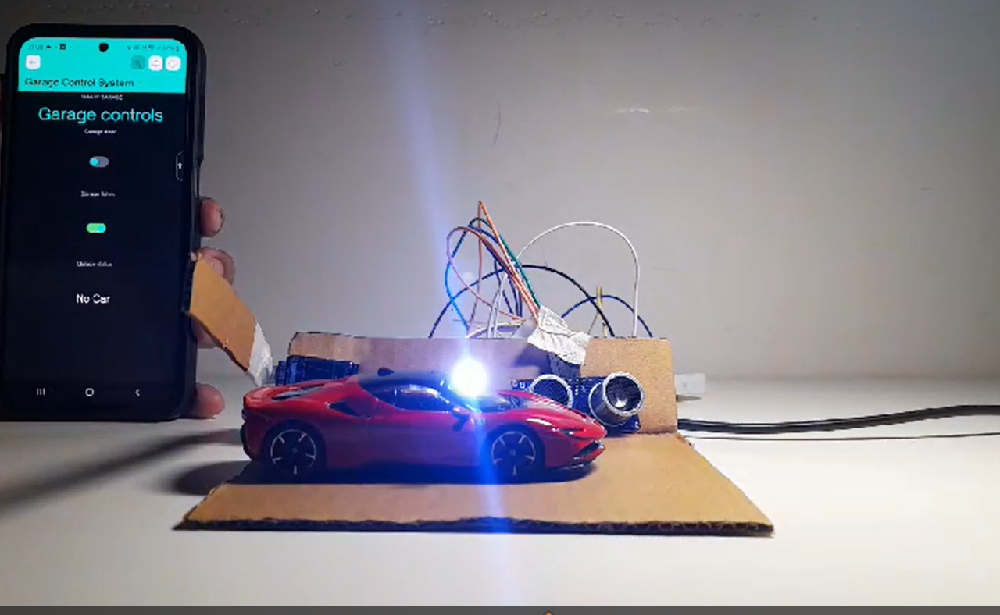
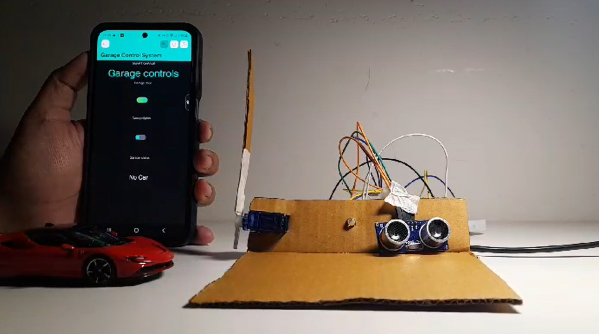

# iot-garage-controller

An IoT-enabled garage control system using ESP32, Blynk, and common components like a servo, LED, buzzer, and ultrasonic sensor. Control your garage and monitor car presence remotely via a mobile app.
Below are key images illustrating the system, setup, and app interface. 

## Project Screenshots

|  |  |
|:-----------------------------:|:-----------------------------:|:-----------------------------:|
| **Blynk App Interface**       | **Circuit Diagram**           | **Hardware Setup**            |

|  |  |  |
|:-----------------------------:|:-----------------------------:|:-----------------------------:|
| **Garage lights**     | **Garage Door**       | **Car status**     |

---

## Abstract

This project presents the design and implementation of an IoT-based smart garage system that automates vehicle detection and garage door control while providing real-time user feedback through an integrated mobile application. The system is equipped with an ultrasonic sensor to detect the presence of a car within the garage, a servo motor to open and close the garage door, and a combination of a buzzer and an LED to provide audio-visual notifications during door operations.

The Blynk IoT platform is utilized to enable remote control and monitoring, allowing users to operate the garage door and receive status updates from anywhere. When the ultrasonic sensor detects the car’s presence, the status is displayed on the Blynk app, and users can remotely control the servo motor to open or close the door. Additionally, the buzzer and LED activate as feedback mechanisms, ensuring the system is user-friendly and accessible.

This project demonstrates the integration of IoT technologies with hardware components to create a practical, efficient, and scalable solution for smart home automation. It underscores the benefits of automation in improving convenience, security, and functionality, showcasing the transformative potential of IoT in everyday applications.

---

## Main Features

- **Ultrasonic Sensor Integration**: Detects the presence of a car in the garage and updates its status in real-time.
- **Servo Motor Control**: Automates the opening and closing of the garage door, providing secure and efficient access.
- **Blynk IoT Application Integration**: Enables remote control and monitoring of the garage system, allowing users to operate the door and check car presence status from anywhere.

---

## Hardware Requirements

- ESP32 board
- Servo motor (SG90 or similar)
- HC-SR04 ultrasonic sensor (or compatible)
- Piezo buzzer
- LED
- Jumper wires, breadboard

---

## Circuit Diagram

1. **Servo Motor**
    - Signal Pin: 13
    - VCC: 5V
    - GND: GND

2. **Buzzer**
    - Positive Pin: 26
    - Negative Pin: GND

3. **LED**
    - Positive (Anode): 25 (via a resistor, e.g., 220 ohms)
    - Negative (Cathode): GND

4. **Ultrasonic Sensor (HC-SR04)**
    - Trigger Pin: 14
    - Echo Pin: 27
    - VCC: 5V
    - GND: GND

5. **Microcontroller (ESP32)**
    - Connect to USB or external power supply.
    - All components share a common GND.

---

## Pin Connections

| Component            | ESP32 Pin |
|----------------------|-----------|
| Servo                | 13        |
| Buzzer               | 26        |
| LED                  | 25        |
| Ultrasonic Trigger   | 14        |
| Ultrasonic Echo      | 27        |

---

## Software Requirements

- Arduino IDE or PlatformIO
- Blynk IoT app (Android/iOS)
- Blynk library
- ESP32Servo library

---

## Setup Instructions

1. Clone this repository and open the code in Arduino IDE.
2. Install the needed libraries 
3. Fill in your Wi-Fi credentials and Blynk authentication token in the code (use placeholder or example, never real credentials).
4. Upload to your ESP32 board.
5. Wire up the hardware as per the pin connections table.
6. In the Blynk app:
    - Add a **Button Widget** on V1 (Servo/Garage Door)
    - Add a **Button or Switch Widget** on V2 (LED)
    - Add a **Value Display Widget** on V3 (Car Presence Status)
7. Power on and control your garage system remotely.

